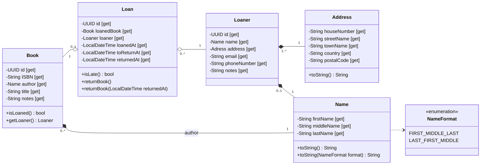

Voor de leesbaarheid zijn getters en setters achterwege gelaten. 
In plaats daarvan zijn deze zichtbaar gemaakt met `[get, set]`, `[get]` of `[set]` achter de relevante variabele.

Tevens zijn, om herhaling te voorkomen, 
de implementatiemethoden die gedefinieërd zijn in Interface of Abstracte klassen achterwege gelaten in de relevante implementatieklassen. 
Tenzij deze, in het geval van abstracte klassen, een non-abstracte methode overschrijven.